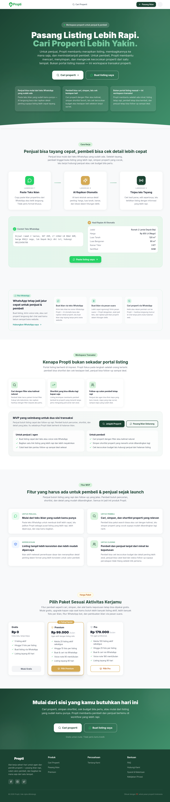
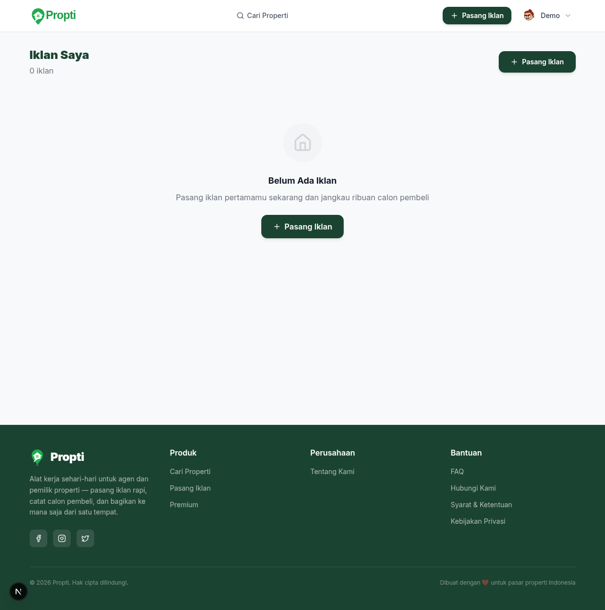
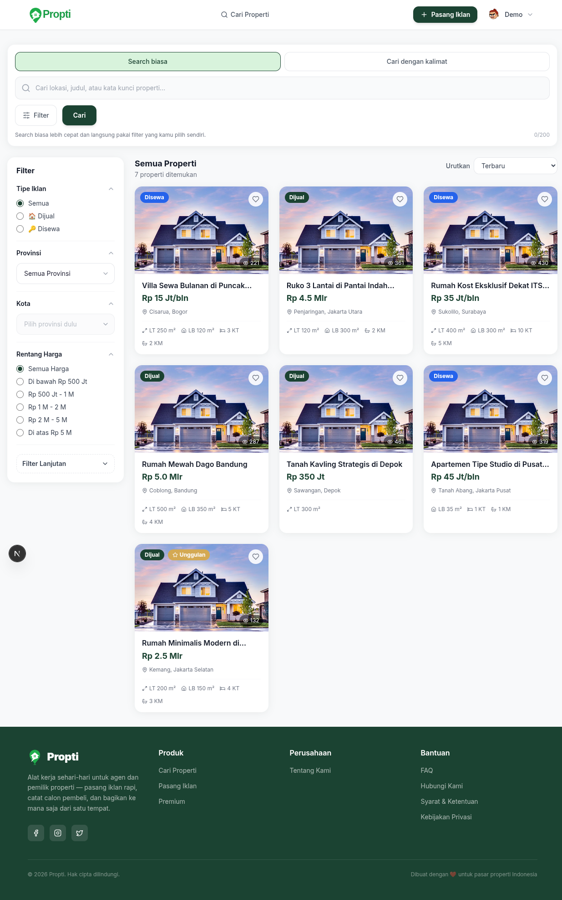
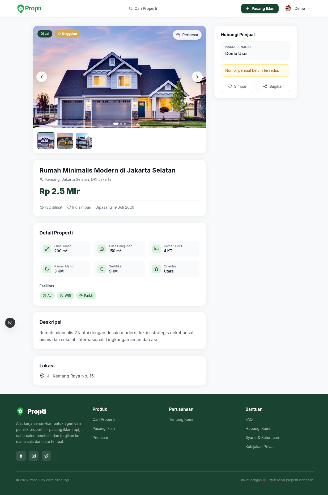
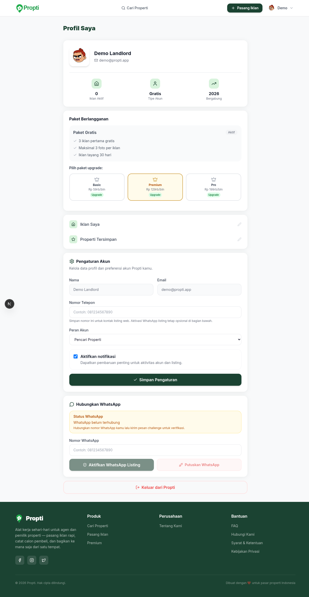
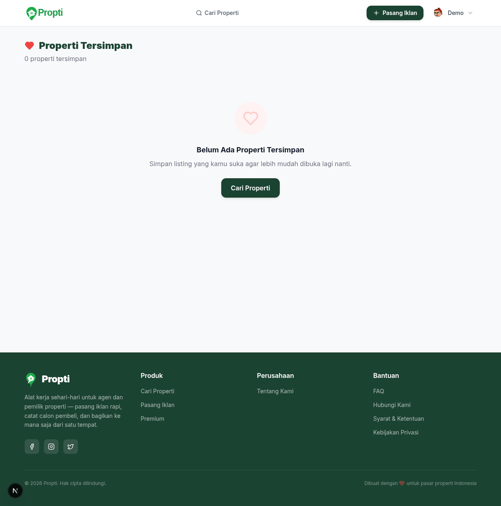
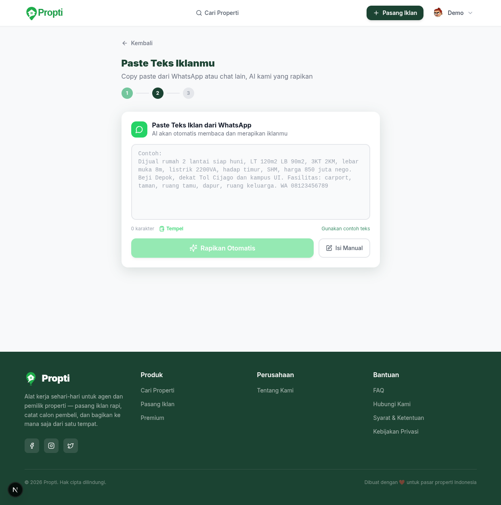

# Propti — AI-Powered Real Estate Workspace

**Propti** is an Indonesian real estate platform that lets agents and property owners create professional listings from informal WhatsApp-style text, powered by AI. Search for properties with natural language, manage leads through a built-in CRM, and accept payments via DOKU — all in one workspace.

[](LICENSE)

## Screenshots

**Landing page** — Hero section, pricing tiers, feature highlights, and a call-to-action for agents and property owners.

[](docs/screenshots/01_landing_page.png)

**Login page** — Google OAuth sign-in with a clean, focused layout. Demo mode auto-authenticates locally.

[](docs/screenshots/02_login_page.png)

**Property search** — Browse all active listings with filters for type, location, and price range. AI-powered natural language search is one toggle away.

[](docs/screenshots/03_search_listings.png)

**Listing detail** — Full property view with image gallery, map, key specs, and seller contact reveal.

[](docs/screenshots/04_listing_detail.png)

**Profile dashboard** — Subscription management, usage stats, WhatsApp linking, and account settings in one place.

[](docs/screenshots/05_profile_dashboard.png)

**Saved listings** — Bookmarked properties for quick access, synced across sessions.

[](docs/screenshots/06_saved_listings.png)

**Create listing** — Paste informal WhatsApp text or fill a manual form. AI extracts and structures all property details automatically.

[](docs/screenshots/07_create_listing.png)

## Features

- **AI-Powered Listing Creation** — Paste informal WhatsApp-style property text; AI extracts title, price, rooms, location, and amenities into a structured listing.
- **Natural Language Search** — Search properties with queries like "rumah murah di Jakarta Selatan dekat sekolah" instead of filling complex filters.
- **Subscription Tiers** — Free (5 active listings, 5 photos), Premium (25 listings, 15 photos, WhatsApp read), and Pro (100 listings, 25 photos, voice input).
- **WhatsApp Bot** — Link your WhatsApp number to receive listing creation requests and lead inquiries directly in chat. Supports Twilio and Meta WhatsApp.
- **CRM & Lead Management** — Track leads through stages (new → interested → viewing → negotiation → deal), schedule follow-ups, add notes, and view analytics.
- **DOKU Payment Gateway** — Accept payments in IDR via virtual accounts and e-wallets. Feature listings and upgrade subscriptions through hosted checkout.
- **Google OAuth** — Simple sign-in with a Google account. No password management needed.
- **Location Autocomplete** — Province, city, and district suggestions with Google Maps integration.

## Architecture

```
┌──────────────────────────────────────────────────────────────┐
│                        Client Browser                         │
│  ┌────────────────────────────────────────────────────────┐  │
│  │              Next.js 15 (App Router)                    │  │
│  │  ┌──────────┐  ┌──────────┐  ┌────────────────────┐   │  │
│  │  │ NextAuth │  │TanStack  │  │ React Hook Form    │   │  │
│  │  │ (Google) │  │ Query    │  │ + Zod validation   │   │  │
│  │  └──────────┘  └──────────┘  └────────────────────┘   │  │
│  │  ┌──────────────────────────────────────────────────┐ │  │
│  │  │          Tailwind CSS + Radix UI                 │ │  │
│  │  └──────────────────────────────────────────────────┘ │  │
│  └────────────────────────────────────────────────────────┘  │
└──────────────────────────┬───────────────────────────────────┘
                           │ HTTPS
┌──────────────────────────▼───────────────────────────────────┐
│                     AWS Cloud (ap-southeast-1)                │
│  ┌────────────────────────────────────────────────────────┐  │
│  │                   API Gateway (REST)                    │  │
│  └──────┬──────────┬──────────┬──────────┬────────────────┘  │
│         │          │          │          │                    │
│  ┌──────▼──┐ ┌─────▼───┐ ┌───▼────┐ ┌──▼────────┐           │
│  │ Go      │ │ Go      │ │ Go     │ │ Go        │           │
│  │ Lambda  │ │ Lambda  │ │ Lambda │ │ Lambda    │           │
│  │ Auth    │ │Listing  │ │Payment │ │ WhatsApp  │           │
│  └────┬────┘ └────┬────┘ └───┬────┘ └────┬──────┘           │
│       │           │          │            │                   │
│  ┌────▼───────────▼──────────▼────────────▼──────┐           │
│  │              Amazon DynamoDB                   │           │
│  │  ┌──────────┐ ┌──────────┐ ┌───────────────┐ │           │
│  │  │ Listings │ │  Users   │ │ Transactions  │ │           │
│  │  ├──────────┤ ├──────────┤ ├───────────────┤ │           │
│  │  │  Leads   │ │Moderation│ │Upload Sessions│ │           │
│  │  ├──────────┤ ├──────────┤ ├───────────────┤ │           │
│  │  │ WhatsApp │ │   OTP    │ │               │ │           │
│  │  │ Sessions │ │Challenges│ │               │ │           │
│  │  └──────────┘ └──────────┘ └───────────────┘ │           │
│  └──────────────────────────────────────────────┘           │
│  ┌──────────────┐                                           │
│  │ Amazon S3    │  ← Listing images & thumbnails             │
│  └──────────────┘                                           │
└──────────────────────────────────────────────────────────────┘

External Services
  ├── OpenAI (GPT-4 mini)  →  AI text parsing & search intent
  ├── Google Maps Platform →  Geocoding & location autocomplete
  ├── DOKU                 →  Payment processing (IDR)
  └── Twilio / Meta        →  WhatsApp messaging
```

### Key Design Decisions

- **Two-auth-layer**: NextAuth.js handles Google OAuth on the frontend, then exchanges the Google ID token for a backend-issued JWT. All API calls use the backend JWT.
- **Single-table design**: DynamoDB tables use composite keys (`PK` + `SK`) with global secondary indexes for common access patterns.
- **Demo mode**: Set `NEXT_PUBLIC_DEMO_MODE=true` to bypass Google OAuth locally. The backend accepts mock ID tokens prefixed with `mock-`.
- **No ORM**: Direct DynamoDB SDK usage with handwritten repository patterns for full control over access patterns and index usage.

## Project Structure

```
propti/
├── backend/                       # Go 1.24 Lambda functions (AWS SAM)
│   ├── cmd/                       # Lambda + localserver entry points
│   │   ├── auth/                  #   Auth Lambda
│   │   ├── listings/              #   Listings Lambda
│   │   ├── localserver/           #   Local dev server (native Go)
│   │   ├── payment/               #   Payment webhook Lambda
│   │   └── whatsapp/              #   WhatsApp webhook Lambda
│   ├── internal/
│   │   ├── data/                  #   Static data (Indonesia locations)
│   │   ├── handlers/              #   HTTP handlers (auth, listings, search, leads, payments, WhatsApp)
│   │   ├── models/                #   Domain types & DynamoDB marshalling
│   │   ├── payments/              #   DOKU payment provider
│   │   ├── repository/            #   DynamoDB CRUD operations
│   │   ├── services/              #   Business logic (AI, search, subscriptions, moderation, WhatsApp)
│   │   └── utils/                 #   JWT, validation, response helpers
│   ├── template.yaml              # AWS SAM infrastructure definition
│   ├── .env.local.example         # Committed: local dev template
│   ├── .env.development.example   # Committed: dev env template
│   └── .env.production.example    # Committed: production env template
├── frontend/                      # Next.js 15 application (Vercel)
│   ├── app/                       # App Router pages & layouts
│   │   ├── (auth)/                #   Login & callback routes
│   │   └── (app)/                 #   Authenticated routes (listings, search, profile, saved, etc.)
│   ├── components/                # React components (auth, ui, layout, listings)
│   ├── hooks/                     # Custom React hooks
│   ├── lib/                       # API client, auth, utils
│   ├── styles/                    # Global styles
│   ├── types/                     # TypeScript type definitions
│   ├── .env.local.example         # Committed: local dev template
│   ├── .env.development.example   # Committed: dev env template
│   └── .env.production.example    # Committed: production env template
├── scripts/
│   ├── dev-local.mjs              # Local dev orchestrator
│   ├── dev-local.test.mjs         # Orchestrator tests
│   └── seed-local.mjs             # Seed script for local dummy data
├── docs/
│   ├── screenshots/               # Application screenshots
│   ├── LOCAL_SETUP.md             # Detailed local development guide
│   ├── DEPLOYMENT.md              # Deployment reference
│   └── BRAND_GUIDELINES.md        # Brand design system
├── docker-compose.yml             # Local infrastructure (DynamoDB + MinIO)
└── README.md
```

## Local Development

### Prerequisites

- Go 1.24+
- Node.js 20+
- Docker (or Podman with `podman-docker`)

### Quick Start

```bash
git clone https://github.com/fiando/propti-chat-listing.git
cd propti-chat-listing

# Install dependencies
cd frontend && npm install
cd ../backend && go mod download
cd ..

# Create env files from committed templates
cp frontend/.env.local.example frontend/.env.local
cp backend/.env.local.example backend/.env.local

# Add NEXT_PUBLIC_DEMO_MODE=true to frontend/.env.local to enable demo login
echo "NEXT_PUBLIC_DEMO_MODE=true" >> frontend/.env.local

# Start local infrastructure
docker compose up -d

# Seed with dummy data
node scripts/seed-local.mjs

# Start both services
./scripts/dev-local.mjs
```

- Frontend: `http://localhost:3000`
- Backend API: `http://localhost:3001`
- DynamoDB Local: `http://localhost:8000`
- MinIO Console: `http://localhost:9001` (login: `minioadmin` / `minioadmin`)

### Environment Files

Committed example files serve as the source of truth for required variables:

| File                                | Purpose                      |
| ----------------------------------- | ---------------------------- |
| `frontend/.env.local.example`       | Local development template   |
| `frontend/.env.development.example` | Development/staging template |
| `frontend/.env.production.example`  | Production template          |
| `backend/.env.local.example`        | Local development template   |
| `backend/.env.development.example`  | Development/staging template |
| `backend/.env.production.example`   | Production template          |

Copy these to their non-example counterparts (e.g., `.env.local`) and fill in real values. The actual env files (`.env.local`, `.env.development`, `.env.production`) are git-ignored and should never be committed.

### Demo Mode

When `NEXT_PUBLIC_DEMO_MODE=true` is set in `frontend/.env.local`:

- The login page auto-authenticates as `demo@propti.app` without Google OAuth.
- The backend accepts mock ID tokens prefixed with `mock-` for local development.
- Use the seed script (`node scripts/seed-local.mjs`) to populate DynamoDB Local with dummy data.

### Docker Compose Services

| Service        | Port                       | Purpose                                        |
| -------------- | -------------------------- | ---------------------------------------------- |
| DynamoDB Local | 8000                       | Local NoSQL database (persistent volume)       |
| MinIO          | 9000 (API), 9001 (Console) | S3-compatible object storage                   |
| MinIO Setup    | —                          | Auto-creates `propti-media-development` bucket |

### Running Tests

```bash
# Backend tests
cd backend && go test ./...

# Frontend tests
cd frontend && npm run lint

# Orchestrator tests
node --test scripts/dev-local.test.mjs
```

## Tech Stack

| Layer              | Technology                                                  |
| ------------------ | ----------------------------------------------------------- |
| **Frontend**       | Next.js 15, TypeScript, Tailwind CSS, Radix UI              |
| **State & Data**   | TanStack Query, Zustand                                     |
| **Forms**          | React Hook Form, Zod                                        |
| **Auth**           | NextAuth.js (Google OAuth), backend JWT                     |
| **Backend**        | Go 1.24, AWS Lambda, API Gateway                            |
| **Database**       | Amazon DynamoDB (8 tables, single-table design)             |
| **Storage**        | Amazon S3 (listing images & thumbnails)                     |
| **AI**             | OpenAI GPT-4 mini (text parsing, search intent, moderation) |
| **Payments**       | DOKU (hosted checkout, VA, e-wallet)                        |
| **Messaging**      | Twilio WhatsApp, Meta WhatsApp Cloud API                    |
| **Maps**           | Google Maps Platform (geocoding, place autocomplete)        |
| **Hosting**        | Vercel (frontend), AWS (backend)                            |
| **CI/CD**          | GitHub Actions (auto-deploy on push to `main`)              |
| **Infrastructure** | AWS SAM (serverless), Docker Compose (local)                |

## Deployment

Deployment is automated via GitHub Actions on push to `main`.

- **Frontend** → Vercel
- **Backend** → AWS SAM

Required GitHub production secrets are listed in the committed env example files. For detailed deployment instructions and troubleshooting, see [docs/DEPLOYMENT.md](docs/DEPLOYMENT.md).

## License

MIT
