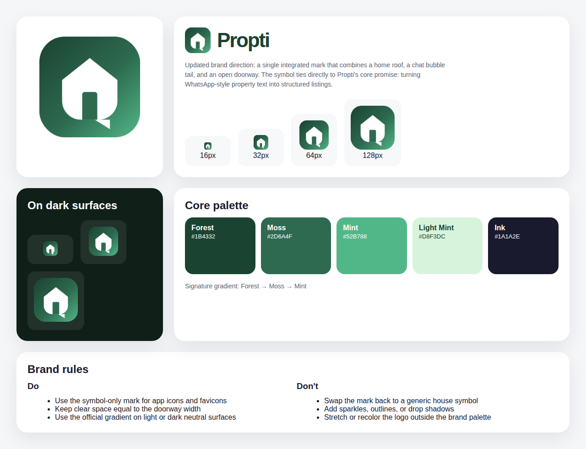

# Propti Brand Guidelines

## Brand Idea

Propti turns messy property information from chat into clean, trusted listings.  
The brand should feel:

- **Helpful** — removes friction from posting and finding property
- **Confident** — clear, structured, and reliable
- **Modern** — product-led, not broker-like
- **Local** — built for Indonesian property behavior and WhatsApp-first workflows

## Logo System

### Primary mark

The Propti mark combines three ideas in one shape:

1. **Roof / home silhouette** — property context
2. **Chat bubble tail** — WhatsApp-style input and conversation-first workflow
3. **Open doorway** — moving from raw text into a ready-to-publish listing

### Lockups

- **App icon / favicon:** use the symbol-only mark
- **Horizontal logo:** use the symbol with the `Propti` wordmark

### Clear space

Keep clear space around the logo equal to at least the width of the doorway inside the symbol.

### Minimum sizes

- **Favicon:** minimum 16×16 px
- **UI surfaces:** 20 px icon height minimum
- **Marketing / docs:** 96 px icon height minimum

## Color Palette

| Token | Hex | Usage |
| --- | --- | --- |
| Forest | `#1B4332` | Primary brand anchor, wordmark on light surfaces |
| Moss | `#2D6A4F` | Depth tone, doorway, mid-gradient stop |
| Mint | `#52B788` | Optimistic accent, gradient finish |
| Light Mint | `#D8F3DC` | Soft highlight and supportive surfaces |
| Canvas | `#F8F9FA` | Default background |
| Ink | `#1A1A2E` | Primary body text |

### Signature gradient

`linear-gradient(135deg, #1B4332 0%, #2D6A4F 55%, #52B788 100%)`

## Typography

- **Primary typeface:** Inter
- **Wordmark style:** bold / black weight with tight tracking
- **Product copy style:** concise, clear, and practical

## Usage Rules

### Do

- Use the official symbol files from `frontend/public/`
- Use the full-color gradient mark on white, off-white, or dark neutral surfaces
- Use the horizontal lockup when there is enough space for the wordmark
- Preserve the symbol proportions and rounded corners

### Don't

- Stretch, rotate, or skew the mark
- Replace the gradient with unrelated colors
- Add extra sparkles, outlines, shadows, or strokes
- Revert to a generic standalone house icon
- Place the full-color mark on clashing saturated backgrounds

## Asset Sources

- `frontend/public/favicon.svg`
- `frontend/public/favicon.ico`
- `frontend/public/favicon-16x16.png`
- `frontend/public/favicon-32x32.png`
- `frontend/public/apple-touch-icon.png`
- `frontend/public/icon-192x192.png`
- `frontend/public/icon-512x512.png`
- `frontend/components/common/ProptiLogo.tsx`
